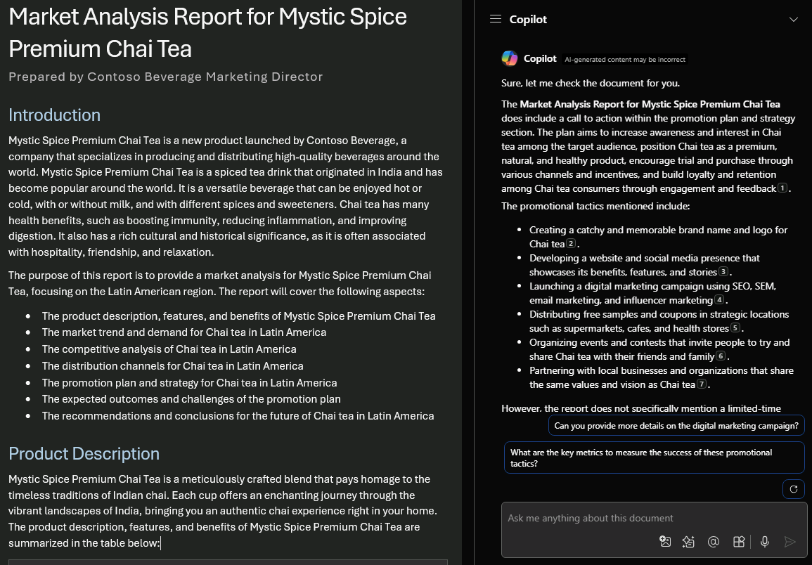

# MS-4005: Craft effective prompts for Microsoft 365 Copilot

## Lesson 4: Asking, analyzing and querying data with Microsoft Copilot

In this lesson, you learn how to craft effective, contextual prompts for Microsoft 365 Copilot to **ask** for information within Microsoft documents and files. If you're looking to enhance your prompting skills for Copilot, this module equips you with the knowledge and techniques to craft prompts that yield accurate and helpful results from Microsoft 365 Copilot.

The focus of this module is **asking**, **analyzing**, and **querying** information using Microsoft 365 Copilot in different Microsoft 365 apps such as **Word**, **PowerPoint**, **Teams**, **Outlook**, and others. You learn how to use these basic creation capabilities, but also how to craft an efficient prompt that contains all the elements to generate the desired results.


## Lab 

By the end of this lesson, you'll be able to:

1. Identify the key elements of an effective prompt and apply them to your own prompts.

1. Ask Copilot how to accomplish a task in Microsoft 365 apps.

1. Use Copilot to answer questions and provide insights about documents, presentations, tables, and notes.

1. Use Microsoft 365 Copilot to ask about projects, documents, and data throughout your organization.


### Exercise 1: Ask Microsoft 365 Copilot in Word for help and recommendations

In this exercise, you'll use Microsoft 365 Copilot in Word to review a market analysis report and evaluate whether it includes a strong call to action. You'll learn how to ask targeted questions by specifying your goal, providing document context, and setting expectations—helping Copilot deliver recommendations to strengthen business communication.

1. In Word, open the **Market Analysis Report for Mystic Spice Premium Chai Tea.docx** document within the **OneDrive\\CopilotDocs\\M04-Ask-analyze-content-with-microsoft-copilot-microsoft-365** folder. 

1. Open the **Copilot** pane by selecting the Copilot icon in the ribbon's **Home** tab. Enter the prompts below and follow along.

    Enter the below prompt: 

    ```
    Is there a call to action?
    ```

    In this simple prompt, you start with the basic **Goal**: _to find a meaningful call to action in the document._ However, you still haven't explained _why_ you need this information.

    Start with a basic prompt by stating your goal clearly.
    For example:

    ```
    Is there a call to action?
    ```

    To improve the prompt, specify the source so Copilot knows where to look.
    You might say: 

    ```
    Is there a call to action in this market analysis report?
    ```

    To make the prompt even more effective, add context that explains what you're looking for and why.
    For example: 

    ```
    We’re trying to address our challenges and concerns. Please check if the marketing plan includes a clear and specific plan of action, such as a promotional strategy or a limited-time discount.
    ```

    To create the most effective prompt, set clear expectations about what kind of response you want.
    You could say: 

    ```
    Let me know if the call to action is clear, and if not, suggest improvements to make it stronger and more actionable.
    ```

    Enter the below crafted prompt:

    ```
    Is there a call to action in this market analysis report to address our challenges and concerns? Please check if the marketing plan includes a clear and specific plan of action, such as a promotional plan or a limited time discount. Please provide suggestions for improving the call to action if necessary.
    ```

    

    This prompt gives Copilot everything it needs to come up with a good answer, including the **Goal**, **Context**, **Source**, and **Expectations**.


### Exercise 2: Get design and organization tips with Microsoft 365 Copilot in PowerPoint

In this exercise, you'll use Microsoft 365 Copilot in PowerPoint to reorganize a presentation for an executive product review. You’ll guide Copilot using prompts that identify the goal of the presentation, link to supporting product documentation, and define how to structure slides with key features, benefits, and comparisons.


1. In PowerPoint, open the **Mystic Spice Premium Chai Market Analysis Presentation.pptx** presentation within the **OneDrive\\CopilotDocs\\M04-Ask-analyze-content-with-microsoft-copilot-microsoft-365** folder. 

1. Open the **Copilot** pane by selecting the Copilot icon in the ribbon's **Home** tab. Enter the prompts below and follow along.

    In this simple prompt, you start with the basic **Goal**: _to organize a PowerPoint_. However, there's no information about why the presentation needs to be summarized or what the summary is needed for.

    Start with a basic prompt by stating your goal clearly.
    For example: 

    ```
    Organize this PowerPoint presentation.
    ```

    To improve the prompt, add context to help Copilot understand the purpose and audience of the presentation.
    You might say: 

    ```
    Organize the presentation for an executive product review happening next week.
    ```

    To make the prompt even more effective, point to a specific source Copilot should use.
    For instance: 

    ```
    Refer to the file Mystic Spice Premium Chai Tea product description.docx for product details.
    ```

    To ensure the best results, set clear expectations for how you want the presentation to be structured and what content to include.
    You could say: 

    ```
    Arrange the slides by product and include an overview, key features and benefits, customer feedback, and a comparison to similar products in the market.
    ```

    Enter the below crafted prompt:

    ```
    Organize this presentation for an executive product review next week. Refer to the Mystic Spice Premium Chai Tea product description.docx for product information. Arrange the slides by product and include an overview, a list of key features and benefits, customer feedback, and a comparison to similar products in the market.
    ```

    In this prompt, the **Goal**, **Context**, **Source**, and **Expectations** are all provided, giving Copilot enough direction to generate a response that meets your needs.


### Exercise 3: Analyze and work with tables using Microsoft 365 Copilot in Excel

In this exercise, you'll use Microsoft 365 Copilot in Excel to create a formula that calculates campaign engagement. You'll refine prompts to include source column references, the calculation goal, and formatting expectations—allowing Copilot to generate accurate, actionable metrics for data-driven decisions.

1. In Excel, open the **Fabrikam Q1 marketing campaigns.xlsx** presentation within the **OneDrive\\CopilotDocs\\M04-Ask-analyze-content-with-microsoft-copilot-microsoft-365** folder. 

1. Open the **Copilot** pane by selecting the Copilot icon in the ribbon's **Home** tab. Enter the prompts below and follow along.

    In this simple prompt, you start with the basic **Goal**: _to create a new column with a formula_. However, there isn’t enough detail to determine what the formula should calculate.  


    Start with a basic prompt by stating your goal.
    For example: 

    ```
    Suggest a formula column.
    ```

    To make the prompt more helpful, add context so Copilot understands what the formula is intended to calculate.
    You might say: 

    ```
    I need a formula for column J to determine the engagement ratio of each campaign.
    ```

    To improve the prompt further, specify the source data that should be used in the calculation.
    For instance: 

    ```
    Use the values from the 'Engaged Users' column and the 'Total Users Targeted' column.
    ```

    Finally, to get the best results, set clear expectations for how the formula should behave and how the result should be formatted.
    You could say: 

    ```
    Ensure the formula divides 'Engaged Users' by 'Total Users Targeted' and displays the result as a percentage.
    ```

    Enter the below crafted prompt:

    ```
    Suggest a formula for column J to calculate the engagement ratio of each campaign. Use the values from 'Engaged Users' and 'Total Users Targeted'. Ensure the formula divides 'Engaged Users' by 'Total Users Targeted' and formats the result as a percentage.
    ```  

    

    Copilot has all the info it needs to give you a solid answer, thanks to the **Goal**, **Context**, **Source**, and **Expectations** in this prompt.

## Explore more

Use these prompts as a starting point. Copy and modify them to suit your needs.

```
Calculate total cost per product in a new column.
```

```
Add a column that calculates the total profit for each marketing campaign in 2022.
```

```
Add a column that calculates the number of days after the product launch event.
```

For more information, see [Generate formula columns with Copilot in Excel](https://support.microsoft.com/office/generate-formula-columns-with-copilot-in-excel-d866d926-9791-4e5f-be2a-c6dd9e587a47).


### Exercise 4: Ask questions about your notes using Microsoft 365 Copilot in OneNote

In this exercise, you'll use Microsoft 365 Copilot in OneNote to analyze notes from recent webinars. You'll craft prompts that request summaries and comparisons based on engagement and attendance data—training Copilot to surface top-performing events and their key takeaways for business reviews.

1. Launch OneNote, by clicking the Windows button and typing in 'OneNote' and pressing enter. 

1. To get started, copy and paste the following text into a new OneNote page. Open the **Copilot** pane by selecting the Copilot icon in the ribbon's **Home** tab. Enter the prompts below and follow along.

```text
Q1 Webinars
    1. AI in Business

        Date: January 15, 2024
        Total Attendees: 450
        Engagement Rate: 72% (Active participation in Q&A, polls, and chat)
        Key Takeaways:
        - AI is reshaping customer service with automated chatbots.
        - Predictive analytics help businesses forecast trends.
        - Ethical AI considerations are becoming a priority.
    
    2. Cloud Security Best Practices
    
        Date: February 10, 2024
        Total Attendees: 385
        Engagement Rate: 65%
        Key Takeaways:
        - Zero Trust security models are on the rise.
        - Multi-factor authentication reduces data breaches.
        - Compliance requirements for cloud security continue to evolve.
    
    3. Future of Remote Work

        Date: March 5, 2024
        Total Attendees: 500
        Engagement Rate: 80%
        Key Takeaways:
        - Hybrid work models are now the standard for many companies.
        - Virtual collaboration tools are improving productivity.
        - Employees expect flexibility but still value in-person interaction.
```

Enter the below prompt:

```
Which webinar had the most attendees and participation?
```

In this simple prompt, you start with the basic **Goal**: _to find out which webinar had the most attendees and participation_. However, you could provide even more information so Copilot can generate a useful response.


Start with a basic prompt by clearly stating your goal.
For example: 

```
Which webinar had the most attendees and participation?
```

To improve the prompt, add context that explains why you need this information.
You might say: 

```
I'm preparing for our quarterly business review and need to highlight the most successful webinar.
```

To make the prompt more specific, point to the source of the information.
For instance: 

```
Please refer to the attendance and engagement data from the notes in our OneNote notebook for the last quarter.
```

Finally, to get the most accurate and useful response, set clear expectations for what you want Copilot to do.
You could say: 

```
Calculate the total number of attendees and the average participation rate for each webinar. Then, identify the one with the highest metrics and provide a short summary of its topic and key takeaways.
```

Enter the below crafted prompt:

```
Which webinar had the most attendees and participation for our quarterly business review? Please refer to the attendance data from the notes for the last quarter. Please calculate the total number of attendees and average participation rate for each webinar. Please identify the webinar with the highest attendance and participation rate and provide a brief summary of its topic and key takeaways.
```

Copilot has all the info it needs to give you a solid answer, thanks to the **Goal**, **Context**, **Source**, and **Expectations** in this prompt.
