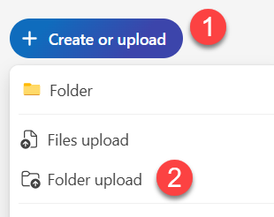

# Lab 1 – Build a Presentation from Start to Finish with Copilot in PowerPoint

## Scenario

Imagine you're a clinical research coordinator at a pharmaceutical company called Contoso Life Sciences. Your team is preparing for an internal strategic review meeting where you need to present the company's research and development roadmap for a novel Alzheimer's drug, ALZ-201. Your goal is to create a compelling presentation that outlines the drug's scientific background, clinical development goals, and early research findings—while ensuring it adheres to internal documentation standards. You've already developed a research plan for the drug and want to use that content when preparing for the meeting.

## Objectives

By the end of this Lab, you'll be able to create a new presentation based on a Word document, insert an image, edit text, organize the presentation, incorporate branding standards, and send the draft presentation to your manager for review using Copilot in PowerPoint.


### Lab Setup: Upload Documents to OneDrive 

1. Download the following zip file to your computer and extract it locally.

   [Sample Files](https://github.com/opsgility/copilot/raw/refs/heads/main/ohiostate/SampleFiles.zip)


1. Follow the steps below to upload all files needed to **OneDrive**:

1. Open **Microsoft Edge** then navigate to the below URL. 

    ```
    https://onedrive.live.com/login
    ```

1. When prompted, loggin with your Microsoft Credentials. 

1. In **OneDrive**, in the top-left corner, select **+ Create or upload** > **Folder upload**.

    [](media/add_new.png)

1. When prompted, name the folder `CopilotTraining`

1. In **File Explorer**, select the folder where you extracted the samples files too, and click **Upload** to upload the folder to OneDrive.

1. Leave **Edge** open and move on to the next task.


## Sample file

Throughout this Lab, we'll craft prompts for Microsoft 365 Copilot that reference the file **Research and Development Plan for ALZ-201.docx**. 

## Exercise 1 – Create a new presentation based on a Word document

1. Open PowerPoint using the desktop application or from your browser at [powerpoint.new](https://powerpoint.new) and start a new presentation.
2. Use Copilot to `Create a presentation with file` and point to *Research and Development Plan for ALZ-201.docx* in your OneDrive.
3. Alternatively, in the prompt dialog box, re-type forward slash (/) and try to locate the name of the file (*Research and Development Plan for ALZ-201.docx*) in the drop down list. If the file doesn't appear in the list, select **Reference a file**, use the upload icon to upload it to OneDrive. 
4. Copilot displays a presentation outline showing the potential slides and bulleted points to be included on each slide. Review the suggested topic and select **Generate slides** to continue. Copilot generates slides and content for each. The presentation may display results in either the Slide Sorter or Normal view.
5. Review the slides and select **Keep it** to continue.
6. While this is a great start, you want to personalize the presentation a bit more for your delivery. Let's see how to improve the content.

## Exercise 2 – Ask Copilot to help you create an icebreaker slide

Because this presentation will be given both in-person and virtually, let's give our audience a few minutes to join without the possibility of missing important information. Copilot can help generate an idea and then a slide for a relevant icebreaker.

1. Let's first change the view in PowerPoint, if necessary. Select **View -> Normal**.
2. Return to the **Home** ribbon view.
3. Open the Copilot pane and enter the following prompt:

   ```
   Can you help me brainstorm an icebreaker question related to neuroscience or brain health that would engage a diverse scientific audience? Provide three options for me to choose from.
   ```

4. Copilot responds with suggestions for your icebreaker. If none of these questions fit what you're looking for, prompt Copilot to generate more suggestions.
5. The first question looks great for our audience, so let's ask Copilot to generate a slide with this question, a corresponding image, and to insert this as the first slide in the presentation.
6. Enter the following prompt:

   ```
   Use question 1 as the icebreaker and generate a slide that includes a complementary image. Insert this slide as the first slide in the presentation.
   ```

## Exercise 3 – Insert an image

While Copilot includes images as it creates slides, you may want to add or edit an image to be more specific to your presentation. You can ask Copilot to include an image from your approved corporate library or generate one based on your input.

1. Let's ask Copilot to insert a relevant image on the title slide.
2. Navigate to the title slide that Copilot generated.
3. Enter the following prompt in the Copilot pane:

   ```
   Replace the image on the title slide with a close-up of a lab technician analyzing brain scans on a digital display.
   ```

4. Copilot opens the Designer feature and creates and displays an image that matches your request.
5. Once the options are shown, select to **Insert** your choice.
6. Delete the original image and edit the new one to best fit the space in the slide.

## Exercise 4 – Edit the text

As you're reviewing the presentation, you may decide the text Copilot generated isn't right for you. Use Copilot to help you refine the text on your slides. For instance, you can type `Edit the text on this slide to make it more concise` or `Make this text more suitable for a scientific audience.` Let's see how:

1. Navigate to the slide containing the text you may want to edit.
2. In the Copilot pane, enter the following prompt:

   ```
   Edit this text to use more technical language appropriate for a research meeting.
   ```

3. Copy and paste the text you want to edit in the Copilot prompt dialog, then select **Send**.
4. Review the suggestions provided by Copilot, then cut and paste it onto the slide, and make any necessary adjustments.

## Exercise 5 – Organize the presentation

As you're reviewing the presentation, you may find that the topics in your presentation need to be more clearly identified. You can use Copilot in PowerPoint to inject this clarity.

1. In the Copilot pane, enter the following prompt:

   ```
   Organize this presentation into sections like Preclinical Studies, Clinical Trial Plan, and Collaborations.
   ```

2. Copilot responds, providing suggestions for each slide. You can select to update the content as you'd like or iterate your prompt to receive additional suggestions.
3. Ensure that your presentation has a logical sequence and smooth transitions between slides.

## (Optional) Exercise – Send a draft for review

Once you're satisfied with your presentation, use Copilot in Outlook to draft an email to your manager for review.

1. Launch Microsoft Outlook from your browser ([outlook.office.com](https://outlook.office.com)) or desktop application and select **New mail**.
2. Select the **Copilot** icon in the email composition window and, in the drop-down menu, select the **Draft** option.
3. Enter the following prompt:

   ```
   Draft an email asking for a review of the R&D presentation for ALZ-201 that I attached to this email. Write the email in a collaborative tone.
   ```

4. Review the email draft, make any necessary edits, and send it to your intended recipient.

---

And just like that, you're all set to communicate your drug development strategy with clarity and impact.  

End of Lab 1